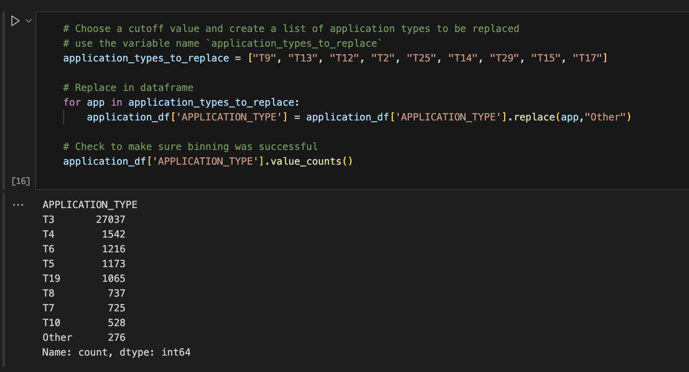

# deep-learning-challenge

During the 2nd iteration of each test, I left the NAME column in, binned the lower-occurring names into Other, and cut out a sample of the data set to make testing run more efficiently.


## Project Overview
The nonprofit foundation Alphabet Soup wanted a tool that can help it select the applicants for funding with the best chance of success in their ventures. Using the Tensorflow neural network library, I used the provided dataset to attempt create an accurate binary classifier that can predict whether applicants will be successful if funded by Alphabet Soup.

## Dataset

Here is an overview of each data point available in our data set.  

EIN and NAME—Identification columns  
APPLICATION_TYPE—Alphabet Soup application type  
AFFILIATION—Affiliated sector of industry  
CLASSIFICATION—Government organization classification  
USE_CASE—Use case for funding  
ORGANIZATION—Organization type  
STATUS—Active status  
INCOME_AMT—Income classification  
SPECIAL_CONSIDERATIONS—Special considerations for application  
ASK_AMT—Funding amount requested  
IS_SUCCESSFUL—Was the money used effectively  

IS_SUCCESSFUL is our predictor or our ```y``` variable.

This was a very large data set, with a lot of one-off values and classifiers that needed to be binned in order to allow our model to run more efficiently.


- Discuss the dataset used in the project.
- Provide details about the data sources, size, and format.
- Explain any preprocessing steps performed on the dataset.

## Model Architecture
- Describe the deep learning model architecture used in the project.
- Explain the rationale behind the chosen architecture.
- Discuss any modifications or enhancements made to the base model.

## Training Process
- Explain the training process, including the optimization algorithm and hyperparameters used.
- Discuss any data augmentation techniques employed during training.
- Provide details about the training duration and convergence criteria.

## Results and Evaluation
- Present the results obtained from the trained model.
- Discuss the evaluation metrics used to assess the model's performance.
- Compare the model's performance against baseline or state-of-the-art approaches.

## Discussion
- Analyze the results and discuss any insights gained from the project.
- Highlight the strengths and limitations of the approach used.
- Identify potential areas for improvement or future work.

## Conclusion
- Summarize the key findings and contributions of the deep-learning-challenge repository.
- Discuss the implications of the project and its potential applications.

## References
- Include a list of references to any external sources or research papers used in the project.

.
